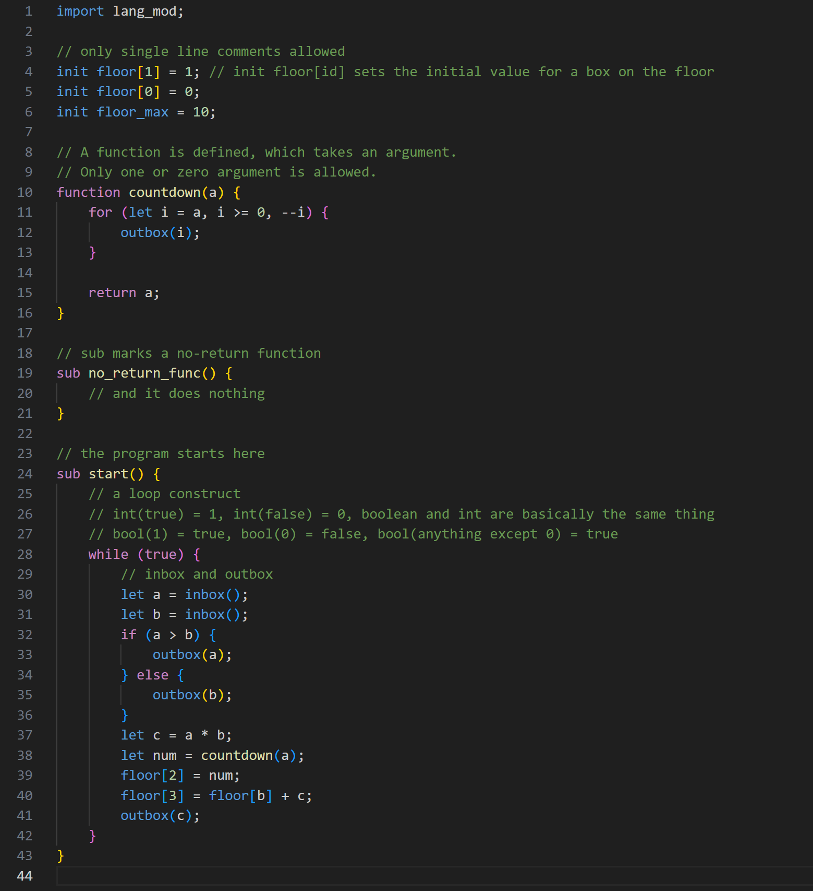

# Human Resource Machine LazyCoder Language Support README

## Introduction

Welcome to **Human Resource Machine LazyCoder**, the ultimate VS Code extension for coding in Human Resource Machine's LazyCoder language. If you’re tired of mundane coding chores, this extension has your back—well, at least when it comes to syntax highlighting! 🌟

For now, it does one thing and does it well: making your LazyCoder code look good. A full-fledged language server is in the works, so stay tuned! 🚀

## Features

This extension provides syntax highlighting for HRML, making it easier to write, read, and understand HRML scripts directly in VSCode. Key features include:
- Highlighting for keywords, function names, and comments.
- Support for single-line comments and specialized keywords like `sub` and `function`.
- Distinctive coloration for control structures, numeric literals, and function definitions.

Example of syntax highlighting in action:

> Tip: Consider adding an animation to demonstrate real-time syntax checking or auto-completion features in future versions!

## Requirements

No specific requirements or dependencies are needed to run this extension. It operates entirely within the VSCode environment.

## Extension Settings

As of now, this extension does not add any configurable settings through VSCode. Future updates might include customizable themes or syntax color settings.

## Known Issues

Currently, there are no reported issues. Should users encounter any bugs or unexpected behavior, they are encouraged to report these on the GitHub issue tracker linked in this document.

## Release Notes

### 0.0.1

- Initial release of the Human Resource Machine LazyCoder Language Support.
- Features basic syntax highlighting according to HRML language specifications.
