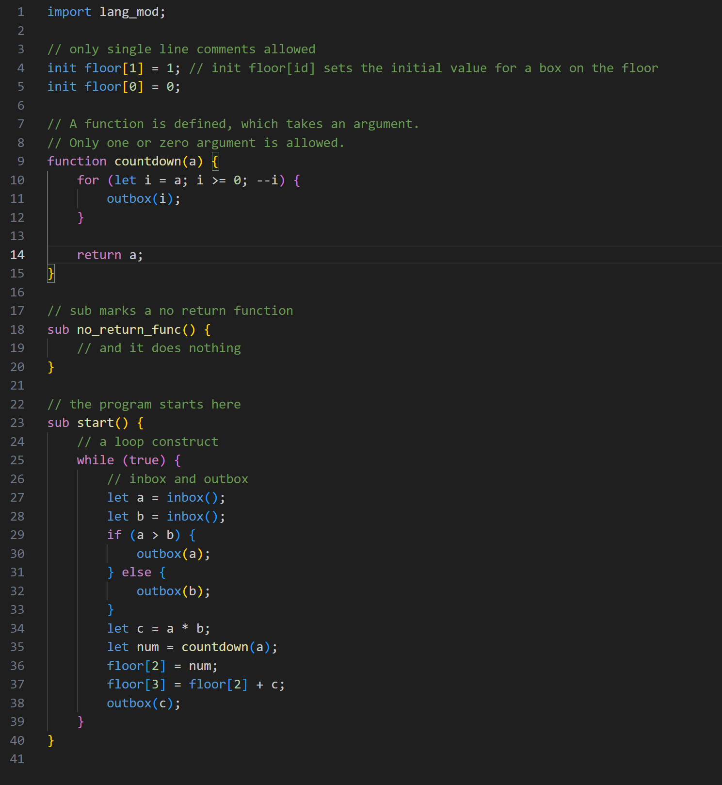

# Human Resource Machine LazyCoder Language Support README

This is the README for your extension "Human Resource Machine LazyCoder Language Support". This extension provides specialized syntax highlighting and editing support for the Human Resource Machine LazyCoder Language (HRL), enhancing the coding experience for developers using this novel language.

## Features

This extension provides syntax highlighting for HRL, making it easier to write, read, and understand HRL scripts directly in VSCode. Key features include:
- Highlighting for keywords, function names, and comments.
- Support for single-line comments and specialized keywords like `sub` and `function`.
- Distinctive coloration for control structures, numeric literals, and function definitions.

Example of syntax highlighting in action:

> Tip: Consider adding an animation to demonstrate real-time syntax checking or auto-completion features in future versions!

## Requirements

No specific requirements or dependencies are needed to run this extension. It operates entirely within the VSCode environment.

## Extension Settings

As of now, this extension does not add any configurable settings through VSCode. Future updates might include customizable themes or syntax color settings.

## Known Issues

Currently, there are no reported issues. Should users encounter any bugs or unexpected behavior, they are encouraged to report these on the GitHub issue tracker linked in this document.

## Release Notes

### 1.0.0

- Initial release of the Human Resource Machine LazyCoder Language Support.
- Features basic syntax highlighting according to HRL language specifications.

### 1.0.1

- Minor bug fixes and performance improvements.

---

## Working with Markdown

Markdown is supported natively in Visual Studio Code. Here are some useful editor keyboard shortcuts:

* Split the editor (`Cmd+\` on macOS or `Ctrl+\` on Windows and Linux).
* Toggle preview (`Shift+Cmd+V` on macOS or `Shift+Ctrl+V` on Windows and Linux).
* Press `Ctrl+Space` (Windows, Linux, macOS) to see a list of Markdown snippets.

## For more information

* [Visual Studio Code's Markdown Support](http://code.visualstudio.com/docs/languages/markdown)
* [Markdown Syntax Reference](https://help.github.com/articles/markdown-basics/)

**Enjoy coding in HRL with enhanced support!**
